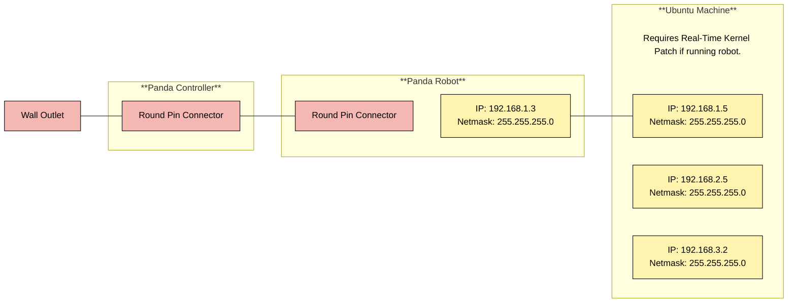
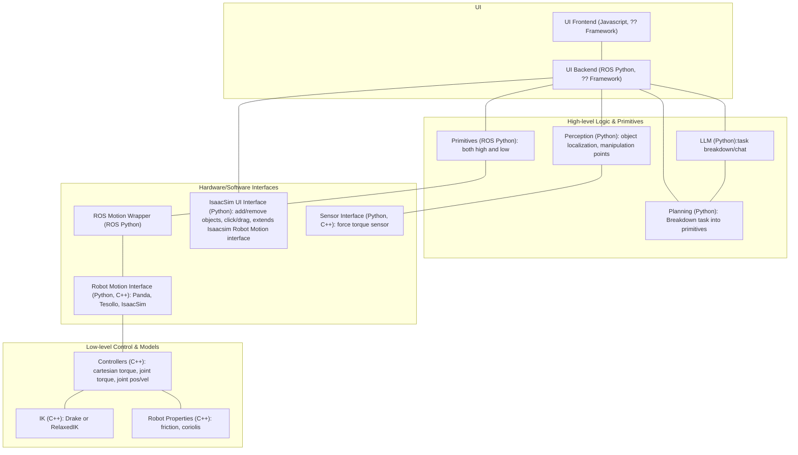

# Dexterity Interface

## Requirements

* For the simulation/interface you will need:
    * Ubuntu Machine  with EITHER:
        * [Docker Engine](https://docs.docker.com/engine/install/). TODO: Add functionality.
        OR
        * Ubuntu 22.04

* For Running on the Panda you will additionally need:
    * Above requirements.
    * Ubuntu Machine with the following added:
        * The [Realtime Kernel Patch Kernel Patch](https://frankaemika.github.io/docs/installation_linux.html#setting-up-the-real-time-kernel).
    * Franka Emika Panda 7 DOF Robot setup with the [FCI](https://frankaemika.github.io/docs/getting_started.html).
        * Robot system version: 4.2.X (FER pandas)
        * Robot / Gripper Server version: 5 / 3
    * [Axio80-M20 Force Torque Sensor](https://www.ati-ia.com/products/ft/ft_models.aspx?id=Axia80-M20) installed on the Panda's End Effector.


<br>

If you are running on the robot, be sure to set the proper static IPs and wiring that you need as shown below:




## Setup
1. Install Ubuntu dependencies:
```bash
sudo apt update
sudo apt install libeigen3-dev
```


## Running


## System Architecture



## Mya notes:
* Isaac Sim 5.0 requires Python3.11, Ubuntu 22.04 or 24.04
* Ubuntu 22.04 is most compatible with ROS 2 Humble which by default uses Python3.10. So would need to compile from source for Python 3.11: https://github.com/isaac-sim/IsaacSim-ros_workspaces/blob/main/build_ros.sh
* Could instead update everything to Ubuntu 24.04 and use Jazzy.

### Todo:
* Figure out which packages are run on what computers.
* Figure out blocking vs non-blocking movement execution
* Allow partial setpoint updates.