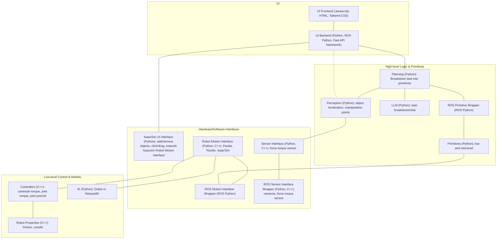

# Dexterity Interface

## System Requirements
This entire system requires 2 machine:
COMPUTER 1: Ubuntu computer (22.04 or 24.04 recommended) with a Nvidia GPU (GeForce RTX 40 Series recommended, preferably >= 4070). This is for running Isaacsim and the interface.
    * You will also need npm installed on this computer. TODO: ADD THIS TO CONTAINER.
COMPUTER 2: Ubuntu computer (20.04, 22.04 or 24.04 recommended) setup with the [Panda FCI](https://frankarobotics.github.io/docs/libfranka/docs/getting_started.html) and [Realtime Kernel Patch Kernel Patch](https://frankarobotics.github.io/docs/libfranka/docs/real_time_kernel.html). This is for running the robot controllers.

The system requires the following hardware:

* 2 Franka Emika Panda 7 DOF Robots.
    * Robot system version: 4.2.X (FER pandas)
    * Robot / Gripper Server version: 5 / 3
* 2 [Tesollo Dg-3F](https://en.tesollo.com/dg-3f-b/) Grippers. 1 mounted on each Panda
* Cameras TODO

TODO: Camera, IP, wiring, mounting specs, update system architecture.


## Setup

### 1. Setup Docker
On **BOTH computers**, follow the below steps.
Note: This allows you to run ros or isaacsim with docker. These instructions are an adapted version of [these](https://docs.isaacsim.omniverse.nvidia.com/5.0.0/installation/install_container.html) and [these](https://isaac-sim.github.io/IsaacLab/main/source/deployment/docker.html)

1. Install Docker by following the `Install using the apt repository` instruction [here](https://docs.docker.com/engine/install/ubuntu/#install-using-the-repository).

2. Install Nvidia Container Toolkit by following [these instructions](https://docs.nvidia.com/datacenter/cloud-native/container-toolkit/latest/install-guide.html). We recommend version 1.17.8 but other versions may work (although we know for sure that version 1.12 has Vulkan issues). 
    * Make sure you complete the `Installation` section for `With apt: Ubuntu, Debian` and also the `Configuring Docker` section.
    * To check proper installation, please run `sudo docker run --rm --runtime=nvidia --gpus all ubuntu nvidia-smi`. This should output a table with your Nvidia driver. If you run into `Failed to initialize NVML: Unknown Error`, reference [this post](https://stackoverflow.com/questions/72932940/failed-to-initialize-nvml-unknown-error-in-docker-after-few-hours) for the solution.

3. Install Docker compose by following there `Install using the repository` [instructions here](https://docs.docker.com/compose/install/linux/#install-using-the-repository).


### 2. Compile and Launch Docker Containers
Run each of these on the specified computer to build and launch the docker container. They will take a while the first time you run them. The reason there are 2 different containers to run is because the Isaacsim one takes A LOT longer to build and is A LOT larger so we also want to give the option of the smaller non-isaacsim container. 

a. On COMPUTER 1 (Docker with Isaacsim, ROS, and workplace dependencies):

```bash
xhost +local: # Note: This isn't very secure but is th easiest way to do this
sudo docker compose -f compose.isaac.yaml build
sudo docker compose -f compose.isaac.yaml run --rm isaac-base  # Opens TERMINAL 1
```

To test that isaacsim is working correctly, you can run `./isaac-sim.sh`.

NOTE: If you need to start another terminal, once the container is started, run `sudo docker compose -f compose.isaac.yaml exec isaac-base bash`

    

    
b. On COMPUTER 2 (Docker with just ROS and workspace dependencies):

```bash
xhost +local: # Note: This isn't very secure but is th easiest way to do this
sudo docker compose -f compose.ros.yaml build
sudo docker compose -f compose.ros.yaml run --rm ros-base  # Opens TERMINAL 1
```

NOTE: if you need to start another terminal, once the container is started, run `sudo docker compose -f compose.ros.yaml exec ros-base bash`. 


### 3. Setup Packages
COMPUTER 1 requires 3 terminal open (TERMINAL 1 and 2 on the CONTAINER, TERMINAL 3 just on the computer). Open TERMINAL 2 in docker using `docker compose -f compose.isaac.yaml exec isaac-base bash`
COMPUTER 2 requires 1 terminal open.


1. On COMPUTER 1, TERMINAL 1, run:

    ```bash
    cd /workspace/libs/robot_motion_interface/ros
    colcon build --symlink-install

    cd /workspace/libs/primitives/ros
    colcon build --symlink-install
    cd /workspace
    ```

2. On COMPUTER 1, TERMINAL 3, run:

    ```bash
    npm install --prefix app/ui_frontend
    ```

3. On COMPUTER 2, TERMINAL 1, run:

    ```bash
    cd /workspace/libs/robot_motion_interface/ros
    colcon build --symlink-install

    cd /workspace/libs/primitives/ros
    colcon build --symlink-install
    cd /workspace
    ```

## Running 
1. In COMPUTER 1 TERMINAL 1, run:
    ```bash
    source libs/robot_motion_interface/ros/install/setup.bash
    source libs/primitives/ros/install/setup.bash

    # Launch simulation on computer with GPU:
    ros2 launch primitives_ros sim.launch.py
    ```

1. In COMPUTER 1 TERMINAL 2, run:
    ```bash
    source libs/robot_motion_interface/ros/install/setup.bash
    source libs/primitives/ros/install/setup.bash
    uvicorn ui_backend.api:app --reload
    ```

3. WAIT until the terminal for STEP 1 says "Creating window for environment". Then in COMPUTER 1 TERMINAL 3, run:
    ```bash
    npm run dev --prefix app/ui_frontend/
    ```

    NOTE: If you instead want to build and run the frontend for production, run the following:
    ```bash
    npm run build --prefix app/ui_frontend/
    npx serve app/ui_frontend/dist
    ```

4. In COMPUTER 2, TERMINAL 1 run:
    ```bash
    source libs/robot_motion_interface/ros/install/setup.bash
    source libs/primitives/ros/install/setup.bash
    ros2 launch primitives_ros real.launch.py
    ```

5. On COMPUTER 1's web browser, go to http://127.0.0.1:3000

    Note: API docs are at  http://127.0.0.1:8000/docs and the API is at http://127.0.0.1:8000/api/<PATH_HERE>.


## Other Setup Options
* Here is another container for Docker with ROS and gamepad/xbox controller (and workspace dependencies). It is good for teleop in  the `primitives` package. The reason there are multiple different containers to run is because the Isaacsim one takes A LOT longer to build and is A LOT larger so we also want to give the option of the smaller non-isaacsim containers.
    ```bash
    xhost +local: # Note: This isn't very secure but is th easiest way to do this
    sudo docker compose -f compose.ros.yaml build
    sudo docker compose -f compose.ros.yaml -f compose.ros.gamepad.yaml run --rm ros-base
    ```

    NOTE: if you need to start another terminal, once the container is started, run `sudo docker compose -f compose.ros.yaml -f compose.ros.gamepad.yaml exec ros-base bash` 


* If you just want to install and run the examples in the child packages (in `libs`), you can do this much more easily with python:

    1. Create a python virtual environment:

        ```bash
        python3.11 -m venv venv-dex
        source venv-dex/bin/activate
        ```
    2. Install the dependencies of all the dependencies by following all the READMEs of the packages inside of the `libs/` folder. Install these in the following order: robot_motion, robot_motion_interface, robot_description, primitives, sensor_interface, planning.


## System Architecture


