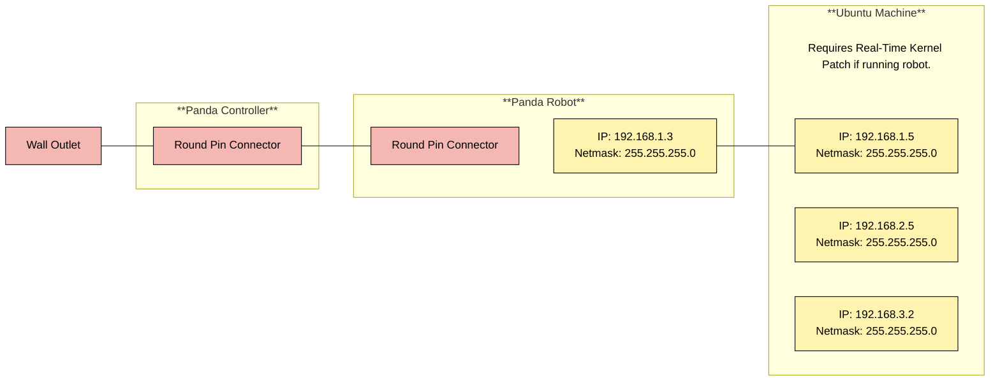
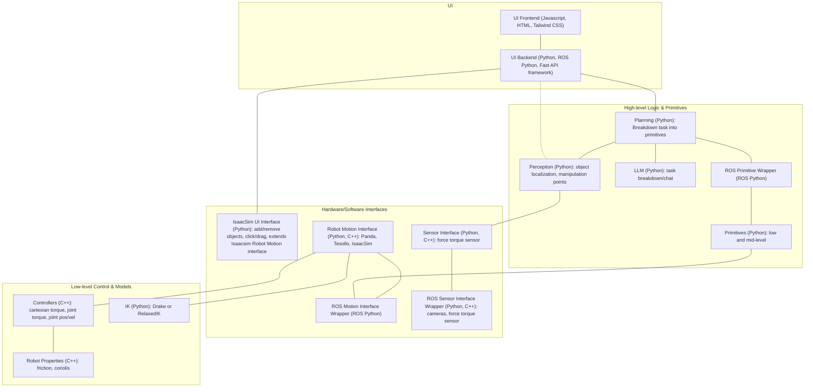

# Dexterity Interface

## Requirements
* For the simulation/interface you will need:
    * Ubuntu Machine  with EITHER:
        * [Docker Engine](https://docs.docker.com/engine/install/). TODO: Add functionality.
        OR
        * Ubuntu 22.04 or 24.04. TODO: Revise if certain version of ROS.
* You can also have the following hardware requirements:
    * Franka Emika Panda 7 DOF Robot setup with the [FCI](https://frankaemika.github.io/docs/getting_started.html).
        * Robot system version: 4.2.X (FER pandas)
        * Robot / Gripper Server version: 5 / 3
        * The [Realtime Kernel Patch Kernel Patch](https://frankaemika.github.io/docs/installation_linux.html#setting-up-the-real-time-kernel) on Ubuntu Machine.

    * [Axio80-M20 Force Torque Sensor](https://www.ati-ia.com/products/ft/ft_models.aspx?id=Axia80-M20) installed on the Panda's End Effector.
    * [Tesollo 3 Finger Gripper]() TODO
    * Cameras TODO


<br>

If you are running on the robot, be sure to set the proper static IPs and wiring that you need as shown below:




## Python Setup
1. Install Ubuntu dependencies:
    ```bash
    sudo apt update
    sudo apt install libeigen3-dev python3.11 python3.11-venv
    ```

2. Create and source python virtual environment
    ```bash
    python3.11 -m venv venv-dex
    source venv-dex/bin/activate
    ```

3. Install IsaacSim and IsaacLab. 
    ```bash
    pip install --upgrade pip
    pip install torch==2.7.0 torchvision==0.22.0 --index-url https://download.pytorch.org/whl/cu128
    pip install isaaclab[isaacsim,all]==2.2.0 --extra-index-url https://pypi.nvidia.com
    ```

    Test that Isaacsim installed correctly. The first time this is run, make sure to reply YES to the EULA prompt. Also the first time it may take a while to start as it sets up the necessary dependencies.
    ```bash
    isaacsim

    ```

4. Install our Python packages:
    ```bash
    pip install -e libs/robot_motion
    pip install -e libs/robot_motion_interface
    pip install -e libs/isaacsim_ui_interface/
    pip install -e libs/sensor_interface/sensor_interface_py

    pip install -e libs/primitives/primitives_py

    pip install -e libs/planning/planning_py
    ```
    
    TODO: Edit the rest of these so they are not so deep 
## Python Running
    ```bash
    python3 -m robot_motion.ik.ranged_ik

    python3 -m robot_motion_interface.isaacsim.isaacsim_interface
    python3 -m robot_motion_interface.tesollo.tesollo_interface
    python3 -m robot_motion_interface.panda.panda_interface
    python3 -m robot_motion_interface.panda.panda_tesollo_unified_interface
    
    python3 -m isaacsim_ui_interface.isaacsim_ui_interface

    python3 -m sensor_interface.camera.kinect_interface
    python3 -m sensor_interface.camera.realsense_interface

    python3 -m primitives.primitive

    python3 -m planning.llm.gpt
    python3 -m planning.perception.yolo_perception
    ```


## TODO: C++ setup/running

## System Architecture



## Mya notes:
* Isaac Sim 5.0 requires Python3.11, Ubuntu 22.04 or 24.04
* Ubuntu 22.04 is most compatible with ROS 2 Humble which by default uses Python3.10. So would need to compile from source for Python 3.11: https://github.com/isaac-sim/IsaacSim-ros_workspaces/blob/main/build_ros.sh
* Could instead update everything to Ubuntu 24.04 and use Jazzy.

### Todo:
* Figure out which packages are run on what computers.
* Figure out blocking vs non-blocking movement execution
* Allow partial setpoint updates.


https://docs.omniverse.nvidia.com/extensions/latest/ext_livestream/webrtc.html
https://isaac-sim.github.io/IsaacLab/main/source/api/lab/isaaclab.app.html


https://github.com/NVIDIA-Omniverse/web-viewer-sample

http://127.0.0.1:8211/streaming/webrtc-client?server=127.0.0.1
http://192.168.1.209:8211/streaming/webrtc-client?server=192.168.1.209


