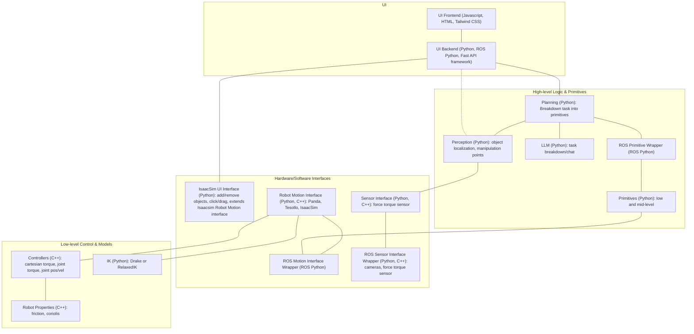

# SHRIMP

## System Requirements
This entire system requires 2 machine:
COMPUTER 1: Ubuntu computer (22.04 or 24.04 recommended) with a Nvidia GPU (GeForce RTX 40 Series recommended, preferably >= 4070). This is for running Isaacsim and the interface.
* You will also need npm installed on this computer.
COMPUTER 2: Ubuntu computer (20.04, 22.04 or 24.04 recommended) setup with the [Panda FCI](https://frankarobotics.github.io/docs/libfranka/docs/getting_started.html) and [Realtime Kernel Patch Kernel Patch](https://frankarobotics.github.io/docs/libfranka/docs/real_time_kernel.html). This is for running the robot controllers.

The system requires the following hardware:

* 2 Franka Emika Panda 7 DOF Robots.
    * Robot system version: 4.2.X (FER pandas)
    * Robot / Gripper Server version: 5 / 3
* 2 [Tesollo Dg-3F](https://en.tesollo.com/dg-3f-b/) Grippers. 1 mounted on each Panda
* 1 Realsense Depth Camera mounted to point at the robot workspace and connected to COMPUTER 1 via USB.

**Please configure your hardware and network according to [these instructions](https://github.com/Wisc-HCI/robot_tutorials/blob/main/instructions/bimanual_system_setup.md).**


## Setup
### 0. Pull submodules
Make sure to pull the git submodules:
```bash
git submodule update --init --recursive
```
### 1. Setup Docker
On **BOTH computers**, follow the below steps.
Note: This allows you to run ros or isaacsim with docker. These instructions are an adapted version of [these](https://docs.isaacsim.omniverse.nvidia.com/5.0.0/installation/install_container.html) and [these](https://isaac-sim.github.io/IsaacLab/main/source/deployment/docker.html)

1. Install Docker by following the `Install using the apt repository` instruction [here](https://docs.docker.com/engine/install/ubuntu/#install-using-the-repository).

2. Install Nvidia Container Toolkit by following [these instructions](https://docs.nvidia.com/datacenter/cloud-native/container-toolkit/latest/install-guide.html). We recommend version 1.17.8 but other versions may work (although we know for sure that version 1.12 has Vulkan issues). 
    * Make sure you complete the `Installation` section for `With apt: Ubuntu, Debian` and also the `Configuring Docker` section.
    * To check proper installation, please run `sudo docker run --rm --runtime=nvidia --gpus all ubuntu nvidia-smi`. This should output a table with your Nvidia driver. If you run into `Failed to initialize NVML: Unknown Error`, reference [this post](https://stackoverflow.com/questions/72932940/failed-to-initialize-nvml-unknown-error-in-docker-after-few-hours) for the solution.

3. Install Docker compose by following there `Install using the repository` [instructions here](https://docs.docker.com/compose/install/linux/#install-using-the-repository).


### 2. Quick Start Container Compilation
To quickly compile and setup the workspace, run this on the COMPUTER 1:

```bash
sudo apt install tmux
./setup_scripts/start_desktop.sh
```
This will launch four terminals.

Similarly, on the COMPUTER 2, run:
```bash
./setup_scripts/start_laptop.sh
```
This will launch just one terminal.

Note, these will take a very long time the first time you run them because Isaacsim is a huge package.

If you want to set up the containers manually, follow the instructions at the bottom of this readme in the `Manual Docker Setup` section


### 3. Camera Calibration
If you move the camera, you will need to re-calibrate it. Make sure it the camera is pointed toward the aruco marker at the center of the table:
On COMPUTER 1, TERMINAL 1:
```bash
cd libs/sensor_interface/sensor_interface_py/src/sensor_interface/camera/config
python calibrate_T_world_color.py --config realsense_config.yaml --marker-size 0.1 --marker-pos 0 0 0.9369 --write
cd /workspace
```

## Running 
1. In COMPUTER 1 TERMINAL 1, run:
    ```bash
    source libs/robot-stack/robot_motion_interface/ros/install/setup.bash
    source libs/primitives/ros/install/setup.bash

    # Launch simulation
    ros2 launch primitives_ros sim.launch.py
    ```

    Note: you can run isaacsim in full screen by default by running:
    ```bash
    ros2 launch primitives_ros sim.launch.py isaac_args:='--kit_args=--/app/window/hideUi=true'
    ```

2. In COMPUTER 1 TERMINAL 2, run:
    ```bash
    source libs/robot-stack/robot_motion_interface/ros/install/setup.bash
    source libs/primitives/ros/install/setup.bash
    uvicorn ui_backend.api:app --reload
    ```

    Note: you can run these other options (after sourcing), too:
    ```bash
    # Use default objects instead of machine vision/camera
    USE_VISION=false uvicorn ui_backend.api:app --reload  

    # Specify specific objects for task (1=set_table,2=pour_snack, 3=cleanup_table)
    TASK=3 uvicorn ui_backend.api:app --reload

    ```

3. WAIT until the terminal for STEP 1 says "Creating window for environment". Then in COMPUTER 1 TERMINAL 3, run:
    ```bash
    npm run dev --prefix app/ui_frontend/
    ```

    NOTE: If you instead want to build and run the frontend for production, run the following:
    ```bash
    npm run build --prefix app/ui_frontend/
    npx serve app/ui_frontend/dist
    ```

4. In COMPUTER 2, TERMINAL 1 run:
    ```bash
    source libs/robot-stack/robot_motion_interface/ros/install/setup.bash
    source libs/primitives/ros/install/setup.bash
    ros2 launch primitives_ros real.launch.py
    ```

5. On COMPUTER 1's web browser, go to http://127.0.0.1:3000.
    Note, there are also 2 other versions of the system:
    ```bash
    # Show no plan
    http://127.0.0.1:3000?show_plan=false

    # Allow no plan editing/interaction
    http://127.0.0.1:3000?plan_interaction=false
    ```

    Note: API docs are at  http://127.0.0.1:8000/docs and the API is at http://127.0.0.1:8000/api/<PATH_HERE>.


## Manual Docker Setup
This is an alternative to the quick setup section prior. 

### 1. Compile Containers
Run each of these on the specified computer to build and launch the docker container. They will take a while the first time you run them. The reason there are 2 different containers to run is because the Isaacsim one takes A LOT longer to build and is A LOT larger so we also want to give the option of the smaller non-isaacsim container. 

a. On COMPUTER 1 (Docker with Isaacsim, ROS, and workplace dependencies):

```bash
xhost +local: # Note: This isn't very secure but is th easiest way to do this
sudo docker compose -f docker/compose.isaac.yaml build
sudo docker compose -f docker/compose.isaac.yaml run --rm isaac-base  # Opens TERMINAL 1
```

To test that isaacsim is working correctly, you can run `isaacsim`.

NOTE: If you need to start another terminal, once the container is started, run `sudo docker compose -f docker/compose.isaac.yaml exec isaac-base bash`

    
b. On COMPUTER 2 (Docker with just ROS and workspace dependencies):

```bash
xhost +local: # Note: This isn't very secure but is th easiest way to do this
sudo docker compose -f docker/compose.ros.yaml build
sudo docker compose -f docker/compose.ros.yaml run --rm ros-base  # Opens TERMINAL 2
```

NOTE: if you need to start another terminal, once the container is started, run `sudo docker compose -f docker/compose.ros.yaml exec ros-base bash`. 


c. On COMPUTER 1 (Docker with nvidia ROS and workspace dependencies):

```bash
xhost +local: # Note: This isn't very secure but is th easiest way to do this
sudo docker compose -f docker/compose.ros.gpu.yaml build
sudo docker compose -f docker/compose.ros.gpu.yaml run --rm ros-gpu  # Opens TERMINAL 2
```

NOTE: if you need to start another terminal, once the container is started, run `sudo docker compose -f docker/compose.ros.gpu.yaml exec ros-gpu bash`. 

### 2. Compile Packages
COMPUTER 1 requires 3 terminal open (TERMINAL 1 and 2 on the CONTAINER, TERMINAL 3 just on the computer). Open TERMINAL 2 in docker using `docker compose -f docker/compose.isaac.yaml exec isaac-base bash`
COMPUTER 2 requires 1 terminal open.


1. On COMPUTER 1, TERMINAL 1, run:

    ```bash
    cd /workspace/libs/robot-stack/robot_motion_interface/ros
    colcon build --cmake-clean-cache --symlink-install

    cd /workspace/libs/primitives/ros
    colcon build --cmake-clean-cache --symlink-install
    cd /workspace
    ```

2. On COMPUTER 1, TERMINAL 3, run:

    ```bash
    npm install --prefix app/ui_frontend
    ```

3. On COMPUTER 2, TERMINAL 1, run:

    ```bash
    cd /workspace/libs/robot-stack/robot_motion_interface/ros
    colcon build --cmake-clean-cache --symlink-install

    cd /workspace/libs/primitives/ros
    colcon build --cmake-clean-cache --symlink-install
    cd /workspace
    ```


### Note: Other containers you can launch...**

* Here is another container for Docker with ROS and gamepad/xbox controller (and workspace dependencies). It is good for teleop in  the `primitives` package. The reason there are multiple different containers to run is because the Isaacsim one takes A LOT longer to build and is A LOT larger so we also want to give the option of the smaller non-isaacsim containers.
    ```bash
    xhost +local: # Note: This isn't very secure but is th easiest way to do this
    sudo docker compose -f docker/compose.ros.yaml build
    sudo docker compose -f docker/compose.ros.yaml -f docker/compose.ros.gamepad.yaml run --rm ros-base
    ```

    NOTE: if you need to start another terminal, once the container is started, run `sudo docker compose -f docker/compose.ros.yaml -f docker/compose.ros.gamepad.yaml exec ros-base bash` 

* Here is another container for mujoco (and workspace dependencies). This takes ~6 minutes to install and 
  requires 6GB of space.
    ```bash
    xhost +local: # Note: This isn't very secure but is th easiest way to do this
    sudo docker compose -f docker/compose.mujoco.yaml build
    sudo docker compose -f docker/compose.mujoco.yaml run --rm mujoco-base
    ```

    Run `python -m mujoco.viewer` to test everything is setup (empty mujoco window will appear).
    
    NOTE: if you need to start another terminal, once the container is started, run `sudo docker compose -f docker/compose.ros.yaml exec mujoco-base bash` 


## System Architecture

```mermaid
flowchart TD

%% --- UI (top) ---
subgraph L1["UI"]
  UIF["UI Frontend (Javascript, HTML, Tailwind CSS)"]
  UIB["UI Backend (Python, ROS Python, Fast API framework)"]
  UIF --- UIB
end

%% --- High-level logic / Primitives ---
subgraph L2["High-level Logic & Primitives"]
  PRIM["Primitives (Python): low and mid-level"]
  ROS_PRIM["ROS Primitive Wrapper (ROS Python)"]
  PLAN["Planning (Python): Breakdown task into primitives"]
  LLM["LLM (Python): task breakdown/chat "]
  PERC["Perception (Python): object localization, manipulation points"]
end

%% --- Interfaces ---
subgraph L3["Hardware/Software Interfaces"]
  ISAACI["IsaacSim UI Interface (Python): add/remove objects, click/drag, extends Isaacsim Robot Motion interface"]
  ROS_RMI["ROS Motion Interface Wrapper (ROS Python)"]
  RMI["Robot Motion Interface (Python, C++): Panda, Tesollo, IsaacSim"]

  SENSI["Sensor Interface (Python, C++): force torque sensor"]
  ROS_SENSI["ROS Sensor Interface Wrapper (Python, C++): cameras, force torque sensor"]
end

%% --- Low level (bottom) ---
subgraph L4["Low-level Control & Models"]
  CTRLS["Controllers (C++): cartesian torque, joint torque, joint pos/vel"]
  IK["IK (Python): Drake or RelaxedIK"]
  RPROPS["Robot Properties (C++): friction, coriolis"]
end

%% --- Wiring (top → bottom) ---
UIB --- ISAACI
UIB --- PLAN
UIB -.- PERC


PLAN --- ROS_PRIM
ROS_PRIM --- PRIM
PLAN --- LLM
PLAN --- PERC
PRIM --- ROS_RMI


RMI --- ROS_RMI
PERC --- SENSI
SENSI --- ROS_SENSI


RMI --- CTRLS
RMI --- IK
CTRLS --- RPROPS


```


