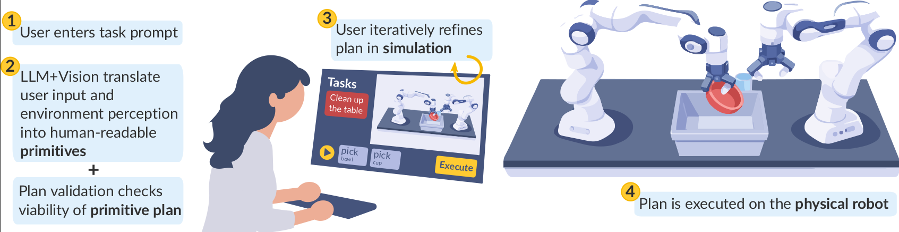

# SHRIMP: Simulation-driven Human-in-the-loop Refinement Interface for Manipulation Planning


SHRIMP is a system that allows users to automatically generate a hierarchical robot primitive plan using
natural language and iteratively revise their plan in simulation through re-prompting and explicit correction, before executing it on the robot.



<video src="docs/assets/SHRIMP_preview.mp4" controls width="600"></video>

## System Requirements
This system requires 2 computers:
* **COMPUTER 1**: Ubuntu computer (20.04, 22.04 or 24.04 recommended) setup with the [Panda FCI](https://frankarobotics.github.io/docs/libfranka/docs/getting_started.html) and [Realtime Kernel Patch Kernel Patch](https://frankarobotics.github.io/docs/libfranka/docs/real_time_kernel.html). This is for running the robot controllers.
* **COMPUTER 2**: Ubuntu computer (22.04 or 24.04 recommended) with a Nvidia GPU (GeForce RTX 40 Series recommended, preferably >= 4070). This is for running Isaacsim and the interface.

The system also requires the following hardware:
* 2 Franka Emika Panda 7 DOF Robots.
    * Robot system version: 4.2.X (FER pandas)
    * Robot / Gripper Server version: 5 / 3
* 2 [Tesollo Dg-3F](https://en.tesollo.com/dg-3f-b/) Grippers. 1 mounted on each Panda
* 1 Realsense Depth Camera mounted to point at the robot workspace and connected to COMPUTER 1 via USB.

**Please configure your hardware and network according to [these instructions](https://github.com/Wisc-HCI/robot_tutorials/blob/main/instructions/bimanual_system_setup.md).**


## Setup
### 0. Pull submodules
Make sure to pull the git submodules:
```bash
git submodule update --init --recursive
```
### 1. Setup Docker
On **BOTH computers**, follow the below steps.
Note: This allows you to run ros or isaacsim with docker. These instructions are an adapted version of [these](https://docs.isaacsim.omniverse.nvidia.com/5.0.0/installation/install_container.html) and [these](https://isaac-sim.github.io/IsaacLab/main/source/deployment/docker.html)

1. Install Docker by following the `Install using the apt repository` instruction [here](https://docs.docker.com/engine/install/ubuntu/#install-using-the-repository).

2. Install Docker compose by following there `Install using the repository` [instructions here](https://docs.docker.com/compose/install/linux/#install-using-the-repository).


On **COMPUTER 1** follow the below steps:
1. Install Nvidia Container Toolkit by following [these instructions](https://docs.nvidia.com/datacenter/cloud-native/container-toolkit/latest/install-guide.html). We recommend version 1.17.8 but other versions may work (although we know for sure that version 1.12 has Vulkan issues). 
    * Make sure you complete the `Installation` section for `With apt: Ubuntu, Debian` and also the `Configuring Docker` section.
    * To check proper installation, please run `sudo docker run --rm --runtime=nvidia --gpus all ubuntu nvidia-smi`. This should output a table with your Nvidia driver. If you run into `Failed to initialize NVML: Unknown Error`, reference [this post](https://stackoverflow.com/questions/72932940/failed-to-initialize-nvml-unknown-error-in-docker-after-few-hours) for the solution.


### 2. Robot Setup
1. Turn on both robots and tesollo grippers. Wait until the flashing yellow lights on the Pandas turn solid yellow.
2. On the laptop in Franka Desktop, unlock the joints of both robots. Wait until the lights on the Pandas turn blue, then enter FCI mode.
3. Make sure all 4 e-stops are released.

### 3. Quick Start Container Compilation
To quickly compile and setup the workspace, run the following on the COMPUTER 2 (make sure you are in the root of this repo). This will launch four terminals (1:top-left [sim], 2:top-right [backend], 3:bottom-left [frontend], 4:bottom-right [extra]). Note, these will take a very long time the first time you run them because Isaacsim is a huge package. If you do not already have `tmux` installed, this will prompt you to install it with your password.
```bash
./setup_scripts/start_desktop.sh
```
Note, if you already ran this script and don't need the container rebuilt, you can run this instead: `./setup_scripts/start_desktop.sh --no-build`
```

Similarly, on the COMPUTER 1, run the following. This will launch just one terminal.
```bash
./setup_scripts/start_laptop.sh
```

Note, if you already ran this script and don't need the container rebuilt, you can run this instead: `./setup_scripts/start_laptop.sh --no-build`


Wait until all commands have run in all the terminals before moving onto the next step. You can safely ignore the error `listing git files failed - pretending there aren't any git.py` ([source](https://stackoverflow.com/questions/79313343/how-to-fix-setuptools-scm-file-finders-git-listing-git-files-failed)) and `Failed to execute child process “dbus-launch” (No such file or directory)`.

> If you want to set up the containers manually, follow the instructions at the bottom of this readme in the `Manual Docker Setup` section.


### 4. Camera Calibration
If you move the camera, you will need to re-calibrate it. Make sure it the camera is pointed toward the ArUco tag at the center of the table:
On COMPUTER 2, TERMINAL 1 (within the container):
```bash
cd libs/sensor_interface/sensor_interface_py/src/sensor_interface/camera/config
python calibrate_T_world_color.py --config realsense_config.yaml --marker-size 0.1 --marker-pos 0 0 0.9369 --write
cd /workspace
```


## Running 
1. In COMPUTER 2 TERMINAL 1, run this to launch the simulation:
    ```bash
    ros2 launch primitives_ros sim.launch.py
    ```

    Note: you can run isaacsim in full screen by default by running:
    ```bash
    ros2 launch primitives_ros sim.launch.py isaac_args:='--kit_args=--/app/window/hideUi=true'
    ```

    Wait for `[IsaacSession] entering main loop` to appear, then move on to the next step (this may take a couple of minutes, especially on your first try).

2. In COMPUTER 2 TERMINAL 2, run to start the backend :
    ```bash
    uvicorn ui_backend.api:app --reload
    ```

    Note: you can run these other options (after sourcing), too:
    ```bash
    # Use default objects instead of machine vision/camera
    USE_VISION=false uvicorn ui_backend.api:app --reload  

    # Specify specific objects for task (1=set_table,2=pour_snack, 3=cleanup_table)
    TASK=3 uvicorn ui_backend.api:app --reload

    ```

3. WAIT until the terminal for STEP 1 says "Creating window for environment". Then in COMPUTER 1 TERMINAL 3, run:
    ```bash
    npm run dev --prefix app/ui_frontend/
    ```

    NOTE: If you instead want to build and run the frontend for production, run the following:
    ```bash
    npm run build --prefix app/ui_frontend/
    npx serve app/ui_frontend/dist
    ```

4. In COMPUTER 1, TERMINAL 1 run:
    ```bash
    ros2 launch primitives_ros real.launch.py
    ```

    This will home the robots.

5. On COMPUTER 2's web browser, go to http://127.0.0.1:3000.
    Note, there are also 2 other versions of the system:
    ```bash
    # Show no plan
    http://127.0.0.1:3000?show_plan=false

    # Allow no plan editing/interaction
    http://127.0.0.1:3000?plan_interaction=false
    ```

    Note: API docs are at  http://127.0.0.1:8000/docs and the API is at http://127.0.0.1:8000/api/<PATH_HERE>.


## Manual Docker Setup
This is an alternative to the quick setup section prior. 

### 1. Compile Containers
Run each of these on the specified computer to build and launch the docker container. They will take a while the first time you run them. The reason there are 2 different containers to run is because the Isaacsim one takes A LOT longer to build and is A LOT larger so we also want to give the option of the smaller non-isaacsim container. 

a. On COMPUTER 2 (Docker with Isaacsim, ROS, and workplace dependencies):

```bash
sudo docker compose -f docker/compose.isaac.yaml build
sudo docker compose -f docker/compose.isaac.yaml run --rm isaac-base  # Opens TERMINAL 1

# Setup ROS network configuration (if COMPUTER 1 IP changes, this must change)
export ROS_STATIC_PEERS=192.168.4.4
export ROS_AUTOMATIC_DISCOVERY_RANGE=SUBNET
```

To test that isaacsim is working correctly, you can run `isaacsim`.

NOTE: If you need to start another terminal, once the container is started, run `sudo docker compose -f docker/compose.isaac.yaml exec isaac-base bash`

    
b. On COMPUTER 1 (Docker with just ROS and workspace dependencies):

```bash
sudo docker compose -f docker/compose.ros.yaml build
sudo docker compose -f docker/compose.ros.yaml run --rm ros-base  # Opens TERMINAL 2

# Setup ROS network configuration (if COMPUTER 2 IP changes, this must change)
export ROS_STATIC_PEERS=192.168.4.9
export ROS_AUTOMATIC_DISCOVERY_RANGE=SUBNET
```

NOTE: if you need to start another terminal, once the container is started, run `sudo docker compose -f docker/compose.ros.yaml exec ros-base bash`. 


### 2. Compile Packages
COMPUTER 2 requires 3 terminal open (all in the container). Open TERMINAL 2 and 3 in docker using `docker compose -f docker/compose.isaac.yaml exec isaac-base bash`
COMPUTER 1 requires 1 terminal open (in the container).


1. On COMPUTER 2, TERMINAL 1, run:

    ```bash
    cd /workspace/libs/robot-stack/robot_motion_interface/ros
    colcon build --cmake-clean-cache --symlink-install

    cd /workspace/libs/primitives/ros
    colcon build --cmake-clean-cache --symlink-install
    cd /workspace
    ```

2. On COMPUTER 2, TERMINAL 3, run:

    ```bash
    npm install --prefix app/ui_frontend
    ```

3. On COMPUTER 1, TERMINAL 1, run:

    ```bash
    cd /workspace/libs/robot-stack/robot_motion_interface/ros
    colcon build --cmake-clean-cache --symlink-install

    cd /workspace/libs/primitives/ros
    colcon build --cmake-clean-cache --symlink-install
    cd /workspace
    ```

4. Now your computers are setup to continue into the `Running` section instructions.


## System Architecture

